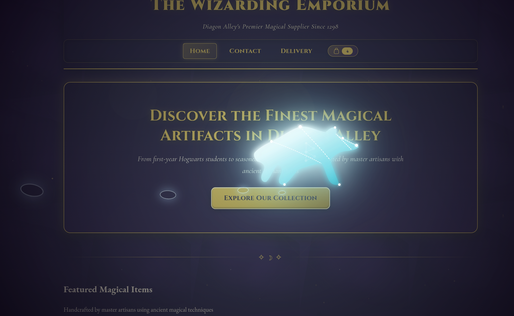
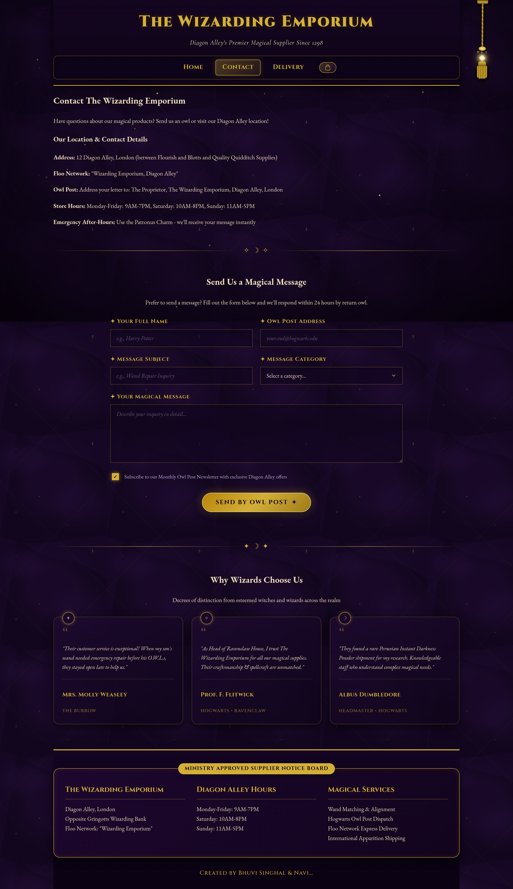
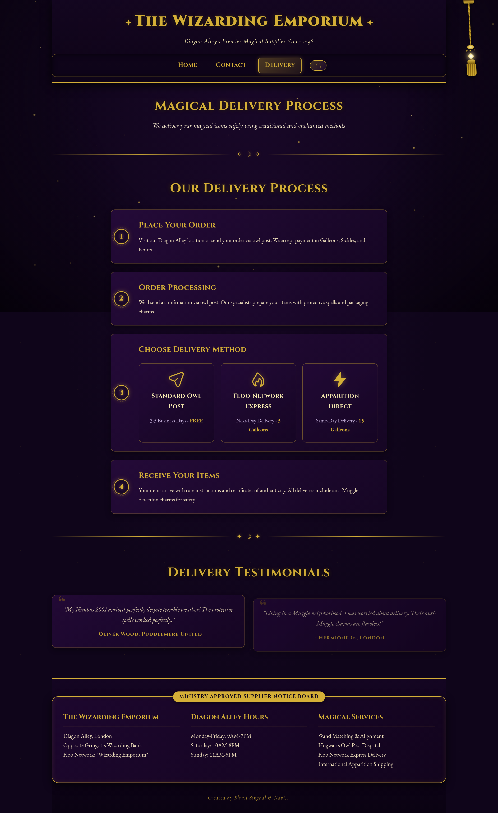

# 🧹 The Wizarding Emporium — Diagon Alley Magical Supplies

> **Diagon Alley's Premier Magical Supplier Since 1298**  
> An immersive, responsive Harry Potter-themed e-commerce web application featuring authentic magical supplies, an interactive **Cinematic Alohomora Spellbook Entrance** (24-hour persistence), a **Signature Hanging Marauder's Map System** with exclusive pull-cord trigger, an interactive **Cauldron Cart Drawer GUI** with magical currency converter, a **Secret Expecto Patronum Bear Incantation**, multi-layered Web Audio sound design, and an official Ministry Decree of Academic Distinction.

---

## 📸 Visual Showcase & Interface Gallery

<div align="center">

### 🪄 1. Entire Diagon Alley Storefront (Full Homepage)

*Visual Analysis: Displays the full Diagon Alley storefront featuring the golden header typography, the top-right hanging Marauder's Map pull-cord mechanism, the 8 primary magical artifact cards (Phoenix Feather Wand, Invisibility Cloak, Nimbus 2001, Time-Turner, Pensieve, Marauder's Map, Golden Snitch, Deluminator) priced in Galleons, the Category grid, Ministry Notice Board, and footer with landing animation replay button.*

</div>

<br>

<div align="center">

### 🐻 2. Expecto Patronum Charm (Silvery Bear & Secret Runic 'B' Signature)

*Visual Analysis: Captured mid-charge during the 5.5-second Patronus apparition. Shows the hand-crafted Grizzly Bear SVG silhouette with long slanted muzzle, nose star node, shoulder hump, trailing stardust mist, ground paw shockwave rings, and the secret Elder Futhark Runic 'B' (Berkana ᛒ) constellation signature glowing bright cyan in the center of the Bear's flank.*

</div>

<br>

<div align="center">
<table>
  <tr>
    <td width="50%" align="center">
      <b>🦉 3. Entire Ministry Owl Post Desk (Full Contact Page)</b><br><br>
      <br><br>
      <i>Visual Analysis: Complete view of the Owl Post Dispatch desk, Diagon Alley location details, magical message form parchment, and decrees of distinction from Mrs. Molly Weasley, Prof. F. Flitwick, and Albus Dumbledore.</i>
    </td>
    <td width="50%" align="center">
      <b>📜 4. Magical Delivery Process (Settled Animations)</b><br><br>
      <br><br>
      <i>Visual Analysis: Full view of the 4-step delivery pipeline (Place Order, Processing, Delivery Method: Standard Owl Post / Floo Network Express / Apparition Direct, Receive Items) and customer testimonials from Oliver Wood & Hermione Granger.</i>
    </td>
  </tr>
</table>
</div>

---

## ✨ Key Features & Technical Highlights

### 🐻 1. Secret Incantation Easter Egg — Expecto Patronum (Bear Patronus)
- **Global Keypress Listener**: Type `EXPECTO PATRONUM` or `PATRONUM` anywhere on the page (outside form input fields).
- **Anatomical Grizzly Bear Vector Silhouette**: Hand-crafted SVG silhouette featuring a prominent Grizzly shoulder hump, long slanted muzzle, nose tip star node, rounded ears, heavy forelimbs, and muscle contour line-art.
- **Secret Runic 'B' (Berkana ᛒ) Signature**: Weaved into the star chart on the Bear's flank. Illuminates brightly to $100\%$ cyan halo glow at the midpoint of the 5.5-second charge ($t \approx 2.2\text{s} \dots 3.6\text{s}$).
- **Web Audio API Stereo-Panned Bass Swell**: Synthesizes a deep sub-bass rumble ($40\text{ Hz} \rightarrow 105\text{ Hz}$) and soaring A-Major chord swell panning from left ear ($-0.88$) to right ear ($+0.88$).

### 🪄 2. Cinematic Alohomora Spell Entrance (24-Hour Persistence)
- **24-Hour Persistence**: Plays once every 24 hours (`localStorage.getItem('alohomora_last_played_time')`). Returning visitors within 24 hours open directly to the Diagon Alley storefront.
- **Multi-Phase Wand & Lock Mechanics**:
  1. **Phase 1 (Intent & Anticipation)**: Environment darkens, ambient dust pauses, lock emits a faint pulse, low magical hum & soft leather sound begins.
  2. **Phase 2 (Wand Trail & Energy Drawing)**: A curved golden spark trail arcs towards the lock, invisible wand stroke-animates magic circle (`strokeDashoffset`).
  3. **Phase 3 (Runes & Inward Streams)**: High crystal chimes & bell harmonics play as energy streams spiral inward to the lock.
  4. **Phase 4 (Lock Resistance & Unlocking)**: Lock vibrates with metal tension sound $\rightarrow$ heavy latch click $\rightarrow$ lock drops with bounce physics (`bounce.out`).
  5. **Phase 5 (Golden Burst & Pages Flutter)**: Warm golden light escapes, 3D leather cover opens, pages flutter open with paper sound.
  6. **Phase 6 (Camera Drift & Lingering Magic)**: Floating camera enters pages into storefront, leaving residual golden dust particles that fade after entry.

### 🧪 3. Interactive Cauldron Cart Drawer GUI
- **Slide-Over Dark Glassmorphic Drawer**: Triggered by clicking the top navigation Cauldron badge on any page.
- **Dynamic Quantity & Item Management**: Add items, increase/decrease quantities (`-` / `+`), and remove items with instant subtotal updates.
- **Magical Currency Converter**: Live calculation converting Galleons to Sickles and Knuts (1 Galleon = 17 Sickles = 493 Knuts).
- **Owl Post Express Checkout**: Triggers an official Ministry Dispatch Receipt modal with randomized order reference numbers (`#WIZ-XXXXX`) and sound effects.
- **`localStorage` Persistence**: Keeps cart state saved between page reloads and navigation.

### 📜 4. Signature Hanging Marauder's Map System (Exclusive Rope Trigger)
- **Exclusive Rope Trigger (`isMapAnimating`)**: Clicking `"Home"`, `"Contact"`, `"Delivery"`, product cards, or any other UI elements will **NEVER** trigger the map animation. The map ONLY activates when the upper-right hanging cord is physically pulled!
- **Physical Pull Cord Mechanism**:
  - Engraved brass ceiling mount (`.ceilingMount`)
  - Braided golden rope with woven texture (`.ropeLine`)
  - Small rune ring (`.runeRingSmall`)
  - Suspended glowing crystal gem (`.crystalGem`) with soft golden aura
  - Layered fabric tassel (`.tasselHead`, `.tasselSkirt`)
  - Idle side-to-side swinging (`@keyframes cordSwayIdle`)
- **Ceiling Scroll Tube & Rollers**:
  - Lowering parchment tube from ceiling (`scrollRollerTop`, `scrollRollerBottom`) attached to upper mechanism.
  - Rollers rotate open, paper unfolds, fold lines and curled corners settle into view.
- **Layered Web Audio API Sound Timeline**:
  - **Hover**: Crystal shimmer (`playHoverShimmer()`)
  - **Press & Drag**: Rope movement & fabric tension (`playRopeTensionSound()`)
  - **Release**: Elastic spring bounce $\rightarrow$ ceiling mechanism unlocks with brass click (`playCeilingUnlockSound()`)
  - **Lowering**: Wood creak & parchment unfurling (`playScrollUnrollSound()`)
  - **Ink Drawing**: Quill scratching & sparkles (`playQuillInkSound()`)
  - **Footprints**: Soft alternating footsteps (`playFootstepSound()`)
  - **Reveal**: Warm orchestral swell (`playFinalSwellSound()`)
  - **Dismissal**: Parchment rolling & wind (`playRetractSound()`)
- **Sequential Footprint Reveal Destinations**:
  1. Title & Subtitle (`THE WIZARDING ASSIGNMENT SCROLL`)
  2. Decree Quote (*"The Ministry of Magical Education hereby records..."*)
  3. 🪶 Created By: Bhuvi Singhal & Navi...
  4. 🏰 Academy: RV University
  5. 📖 Course: B.Tech (Hons) CSE AIML
  6. ⌛ Semester: Semester I
  7. 🏆 Assessment: Internal Assessment II
  8. Official Ministry Approval Seal Stamp

---

## 📁 Enterprise Frontend Directory Structure

```
Assignment2/
├── static/
│   ├── css/
│   │   └── style.css                 # Master CSS stylesheet, design tokens & cart drawer GUI styles
│   ├── js/                           # Modular JS architecture
│   │   ├── alohomora.js              # 3D Alohomora spellbook entrance timeline
│   │   ├── audio.js                  # Web Audio API synth sound engine
│   │   ├── cart.js                   # Cauldron cart drawer GUI controller & state manager
│   │   ├── contact-form.js           # Owl post & prophet animations
│   │   ├── main.js                   # Entry point & HTMLLoader component orchestrator
│   │   ├── patronus.js               # Expecto Patronum Bear Patronus & Runic B signature engine
│   │   ├── scroll-map.js             # Marauder's Map pull-cord & footprint reveal engine
│   │   └── ui.js                     # Ambient sparkles, particle canvas & mobile menu
│   ├── images/                       # High-res item photography (space-free clean naming)
│   │   ├── deluminator.jpg
│   │   ├── golden-snitch.jpg
│   │   ├── invisibility-cloak.jpg
│   │   ├── marauders-map.jpg
│   │   ├── nimbus-2001.jpg
│   │   ├── pensieve.jpg
│   │   ├── time-turner.jpg
│   │   └── wand.jpg
│   └── assets/                       # SVG vector textures, favicons & showcase screenshots
│       ├── background.svg
│       ├── favicon.svg
│       ├── homepage_full.png         # Entire Homepage full-page capture
│       ├── patronus_showcase.png     # Expecto Patronum Bear in-motion action capture
│       ├── contact_full.png          # Entire Contact page full-page capture
│       └── deliv_full.png            # Delivery page (settled animations) full-page capture
├── templates/
│   └── components/                   # Modular HTML templates & overlays
│       ├── alohomora-entrance.html   # 3D Spellbook entrance overlay
│       ├── assignment-scroll.html    # Marauder's Map & hanging pull-cord mechanism
│       └── cauldron-cart.html        # Interactive Cauldron Cart Drawer GUI
├── index.html                        # Storefront page entrypoint
├── contact.html                      # Owl Post / Contact page entrypoint
├── deliv.html                        # Delivery process page entrypoint
├── LICENSE                           # MIT License
└── README.md                         # Project documentation & visual showcase
```

---

## 🛠️ Local Setup

1. **Serve locally**:
   - Open `index.html` directly in any web browser, or serve with python HTTP server:
     ```bash
     python3 -m http.server 8000
     ```
   - Open **`http://localhost:8000`** in your web browser.

---

## ✒️ Credits & Authors

Created by **Bhuvi Singhal & Navi...**  
*RV University &bull; B.Tech (Hons) CSE AIML &bull; Semester I, Internal II*
